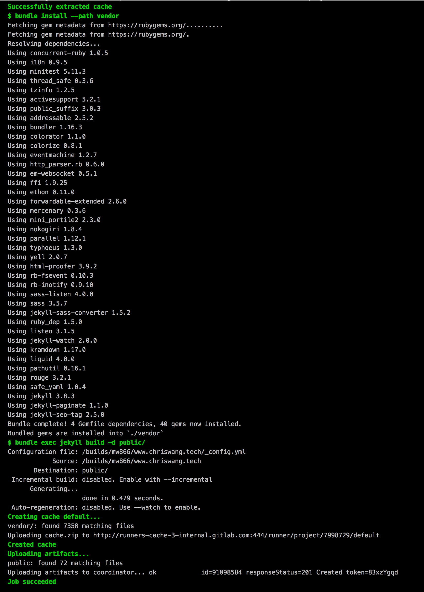

Last year, I had some fun [building a Github Page alternative with AWS CloudFormation and Travis CI](https://chriswang.tech/2017/building-github-pages-alternative/). In retrospect, there was some clear indication of over-engineering. 

And with the expiry of my Github Education subscription, a new home is needed for my private repos. With built-in free CI/CD and unlimited private repos, Gitlab is a godsend. And not forgetting Gitlab Pages for hosting static sites!

# Entering the GitLab-land

At the core of the configuration is the `.gitlab-ci.yml` file.

```yml
# requiring the environment of Ruby 2.3.x
image: ruby:2.3

# add bundle cache to 'vendor' for speeding up builds
cache:
  paths: 
    - vendor/

before_script:
  - bundle install --path vendor

# the 'pages' job will deploy and build your site to the 'public' path
pages:
  stage: deploy
  script:
    - bundle exec jekyll build -d public/
  artifacts:
    paths:
      - public
  only:
    - master # this job will affect only the 'master' branch

# To solve encoding error:
variables:
  LC_ALL: "C.UTF-8"
  LANG: "en_US.UTF-8"
  LANGUAGE: "en_US.UTF-8"
```

And the CI build log is such a delight to watch :)




# Some errors and solutions


### Gitlab CI: `Conversion error: Jekyll::Converters::Scss encountered an error while converting 'assets/css/style.scss': Invalid US-ASCII character "\xE2" on line 5`

Solution: 
Change encoding to UTF-8.

[Reference](https://github.com/jekyll/jekyll/issues/4268#issuecomment-396165096)


### Gitlab CI: Filed to extract & 404 HTTP error at the domain name

Solution: 
The folder must be named `public` instead of `_site` etc.

[Reference](https://docs.gitlab.com/ce/user/project/pages/getting_started_part_four.html#the-public-directory) 


### Browser: Multiple 404 erros returned by .css files
Solution:
`username.gitlab.io/css/monokai.css` is invalid due to the missing repo name in the path.

* Option 1 (Chosen): add an domain name
* Option 2: change `baseurl` to in include the full path `username.gitlab.io/[reponame]/css/monokai.css` at `_config.yml`

[Reference](https://github.com/jekyll/jekyll/issues/4268#issuecomment-377681274)

/Chris