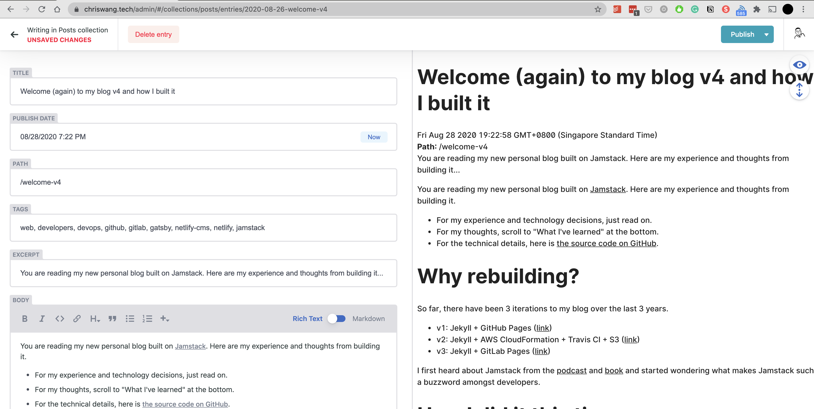

You are reading my new personal blog built on [Jamstack](https://jamstack.org/). Here are my experience and thoughts from building it.

* For my experience and technology decisions, just read on.
* For my thoughts, scroll to "What I've learned" at the bottom.
* For the technical details, here is [the source code on GitHub](https://github.com/mw866/chriswang.tech-gatsby).

# Why rebuilding?

So far, there have been 3 iterations to my blog over the last 3 years.

* v1: Jekyll + GitHub Pages ([link](https://chriswang.tech/personal-website))
* v2: Jekyll + AWS CloudFormation + Travis CI + S3 ([link](https://chriswang.tech/self-managed-gh))
* v3: Jekyll + GitLab Pages ([link](https://chriswang.tech/gitlab-pages);  archived at <https://v3.chriswang.tech/>)

I first heard about Jamstack from the [podcast](https://www.heavybit.com/library/podcasts/jamstack-radio/) and [book](https://www.netlify.com/oreilly-jamstack/) and started wondering what makes Jamstack such a buzzword amongst developers.

# How I did it this time

Like the previous iterations, the first major task is making the right technology decision.

To quote the book [Modern Web Development on the JAMstack](https://www.netlify.com/oreilly-jamstack/), building a Jamstack site requires the folling technology decisions:

> * How you’ll manage the project/code
> * Where you’ll store your content
> * What software will build your site
> * How your build process will be automated
> * Where your site will be published
> * What services and APIs your live site will use

Given the blog both a (a) learning project and (b) production site that will run in the coming months or years, my evaluation criteria for the technologies are:

* New: Some it's something new I can learn;
* Serverless: I don't have time for OS upgrades, high-availability setup, backups, monitoring; and
* Minimal or zero running cost:  The blog does not generate $, so I intend to spend very little $. Sorry, SaaS company who are eager to upsell.

Here is my thought process behind each decision.

## How you’ll manage the project/code

**Popular choices:**

* GitHub <-used before
* GitLab <-used before

**My decision:**

**GitHub**, simply for the higher visibility since I decide to make the source code public. 

I could have chosen GitLab without any issues.

## Where you’ll store your content

**Popular choices:**

* Text Files: Flat markdown or html files <- used before
* Headless CMS: [headlesscms.org](https://headlesscms.org/) is a great catalogue of popular options. 

  * Git-Based CMS: Netlify CMS
  * API-Driven: Ghost Content API (headless mode), Strapi
* Traditional CMS: The good ol' WordPress and Drupal alike

**My choice:**

**Netlify CMS**, for it's just a static single-page-app wrapper of the Git repo. In addtion to allowing me to write from any computer, the ongoing maintenance effort is also very minimal. 

In fact, I have evaluated Ghost Content API, an API-driven headless CMS.  The problem? The effort and cost required for self-hosting a high-availability Ghost and the RDBMS. 

## What software will build your site

**Popular choices:** according to [StaticGen.com ](https://www.staticgen.com/)

* Jekyll (Ruby) <- used before
* Gatsby (ReactJS)
* Hugo (Go)

**My choice:**

**Gatsby**, for its use of ReactJS and GraphQL, which are increasingly popular and worth learning. Its catalogue of official plugins from various sources is pretty extensive too.

## How your build process will be automated

**Popular Choices:**

* GitLab CI <-used before
* Travis CI <-used before
* GitHub Actions
* Netlify

**My choice:**

**Netlify**, for the great developer's experience: (a) native support for Gatsby and Github, no `.yml`  or webhook file to configure (b) build time is pretty good, and (c) deployment included. In fact, the initial setup on Netlify took me  <30 minutes and very intuitive.

## Where your site will be published

**Popular Choices:**

* S3 + CloudFront <-used before
* GitHub Pages <-used before
* GitLab Pages <-used before
* Cloudflare Workers Site with KV store <-used before
* Netlify

**My choice:**

**Netlify**, the deployment is already included in the automated build process.

I have also tried Cloudflare Workers Site. However, the file `netlify-cms-app.js.map` exceeded the 10MB object size limit allowed by Workers KV.

## What services and APIs your live site will use

The blog is static at the moment. 

In the future, I may revisit this part once the [Algolia's Gatsby plugin](https://github.com/algolia/gatsby-plugin-algolia) becomes officially supported.

# What I have learned

This is what I have learned from the 12.5 hours and $0 spent on this project.

Well actually, it may be beyond this project.

## Developers are empowered than ever

I often find developers underpowered back in the days, or in traditional IT organizations. In such environments, the power of the developers is limited by  

* Proprietary software: The developer can't be a rock star Oracle dev if his/her organization can't afford the license fee.
* Infrastructures: The developer can't use the best opensource *nix tools if he/she can only deploy your apps to Microsoft Servers 
* Traditional SDLC / project management: The developer can't experiment and iterate beyond the rigid specs and timeline from your Project Manager. 

In contrast, today's developers are empowered by

* Open-source software: The developer is flooded with an abundance of new tools. 
* Cloud and DevOps: The developer gets to define, orchestrate and scale their infrastructure with the solutions they see fit. 
* Modern project development: The developer's job is to facilitate creative destruction by iterations and experimentation. 

## The Law of Leaky Abstractions

There is also another, not too good, side to the "development empowerment" argument above. 
It is really easy for me to to get started with tools used in the project. However, I have spent most of the time trivial issues without fully understanding the underlying technology well enough. I am looking at you, the `npm` dependency!

The culprit, I think, is [the Law of Leaky Abstractions](https://www.joelonsoftware.com/2002/11/11/the-law-of-leaky-abstractions/). 

> The law of leaky abstractions means that whenever somebody comes up with a wizzy new code-generation tool that is supposed to make us all ever-so-efficient, you hear a lot of people saying “learn how to do it manually first, then use the wizzy tool to save time.” Code generation tools which pretend to abstract out something, like all abstractions, leak, and the only way to deal with the leaks competently is to learn about how the abstractions work and what they are abstracting. So the abstractions save us time working, but they don’t save us time learning.

Leaky abstraction, coupled with the emphasis on developer friendliness, is dangerous because it makes the developer overestimate how competent the person is. It also makes the developer tend to skim the surface of complicated ideas. Neither of such tendency does make great developers.